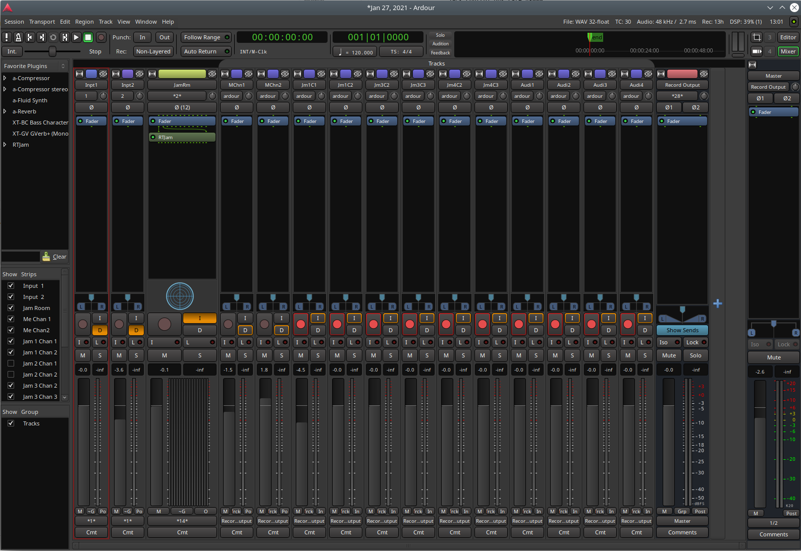

# RTJam

Real Time Music Jam

The Real Time Music Jam software is intended to provide low latency audio over the network that will enable performers to make music as if they were in the same place. The system is comprised of a broadcast server that listens on a UDP port for jam packets and some number of clients that create/consume audio data.

The server keeps a table of up to 5 jammers in the "room" and will forward each packet it receives to the other jammers in the room.  It does not transmit the packet back to the orginator (client provides local monitoring).  Multiple servers can be run each on their own udp port (--port option) each corresponding to it's own "room"

Each jam packet has two separate channels of audio so the jammers can have a channel for voice and guitar, stereo keyboards, or whatever they choose.  The two channels are isochronous for that person.

So in this way a room consists of up to 5 jammers each with two channels or 10 separate audio channels

## Latency Breakdown


* Audio system running 64 sample frames with 2 buffers - Jack delay = 2.67msec
* Jitter Buffer default 512 samples = 8 frames of data at at 1.33msec / frame = 10.6msec
* Network latency (speed of light and buffers in the network) = variable depending on locations and networks.  Figure speed of light is 200km/msec (through glass).


Measuring on my local network I can get best case of 13msec.  Thats with an avg jitter buffer depth of 365 samples (7.6msec), 2.67msec jack delay, x amount of stack delay.  I'm measuring this at the analog interface of my USB 2.0 audio device.  The device has a local mix so I can go 50/50 and see the delay from a mic tap.  Hard to hear, but it's there.

So the bulk of the delay is network transit and jitter buffer.  


## Get The code
```
git clone --recurse-submodules git@github.com:mfvargo/rtjam.git
cd rtjam
make
```

## Components

### VST Plugin (bin/rtjam.vst.so)
The RTJam plugin is a VST built using the DISTRO/DPF open source framework https://github.com/DISTRHO/DPF 

The Plugin will take frames from it's input and push them using UDP to a jamrtime broadcast server.  It will then receive packets from the server that originate from other jamrtime users.  The VST then mixes those channels into a stereo output.  That's the room.

The VST has 12 outputs.  The first two are the mixed channels based on the sliders in the VST.  Outputs 3-12 are the individual channels from the participants in the room.  Using the VST in a DAW package allows all 8 channels to be recorded separately for later mixing.

### Jack Standalone (bin/rtjam)
The RTJam software also builds on the Raspberry Pi 4 and can be run as a "standalone JACK" application.  This has been the most successful implementation for playing music realtime on the internet.  The Pi has a very stable multimedia jack port that can run 64 sample frames with only 2 period of buffer without the dreaded XRUN issues you see on most other platforms.

### App U/X


- Input 1/2 - Shows pre and post fader levels for the users inputs
- 4 player controls - Each control corresponds to another person in the room. The controls are Smooth which increases the jitter buffer depth for that user and two level sliders for that users two channels.

About "Smooth" - the smooth slider should really only be used if the VST is being run inside a DAW.  If you are trying to play music in real time adding smooth might make packet starves sound a little better but you pay for it hard with latency. Smooth at the bottom of the slider give 500 samples of jitter buffer which is about 10msec of latency at 48kHz.  At full scale the jitter buffer is about 20msec long.  This is pretty hard to make a pocket with.

Note: 4/4 time @ 120BPM (pretty standard pop song (think Billie Jean)) will have a 1/4 note of 500msec.  so a 1/16 note is 125msec in duration.  Think about trying to make a pocket like "What Is Hip" by Tower of Power with the 1/16th notes moving around by 20-30%.

### Broadcast Server
The server just listens for packets from VST clients.  The server dynamically creates channels based on the source address of the client packets and forwards packets to all active listeners.  There is currently no session control.  When you start talking the server will allocate a channel to you if one is open.  If you don't send any packets for 2 seconds, your channel is made available.

TODO: The server needs to timestamp and save the packet streams into an archive that can later be imported into some DAW software for mixing.  It might also be possible to have the VST keep the channels demuxed and provide them to the DAW there for recording.

### TODOS
* make server name configurable
* ensure all clients running the same framerate
* allow clients with different sample rates to intermix
* add stereo panning to the channels to help people separate sources.
* make a listen only mode for a VST for live remixing of a room

### Hooking up a Raspberry Pi

https://youtu.be/iUXzOq8HfEQ

### Using With Sample DAW (Ardour)

You can use the VST in a DAW to record sessions for mixing.  In the screen shots below, I have two inputs routed into a channel with the RTJam plugin inserted.  I then route outputs 3-12 of the plugin to separate mono channels that can be record armed and tracked.  Post jam session those tracks can be mixed/engineered. It would also be possible to run a real time mix of those to provide a "house" mix for some kind of live show.



