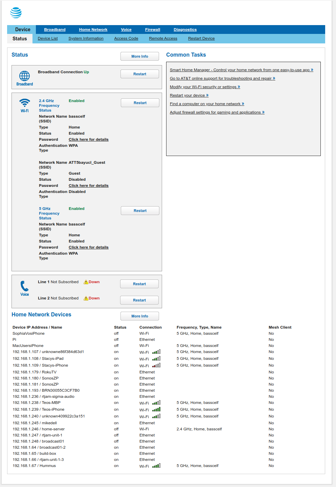
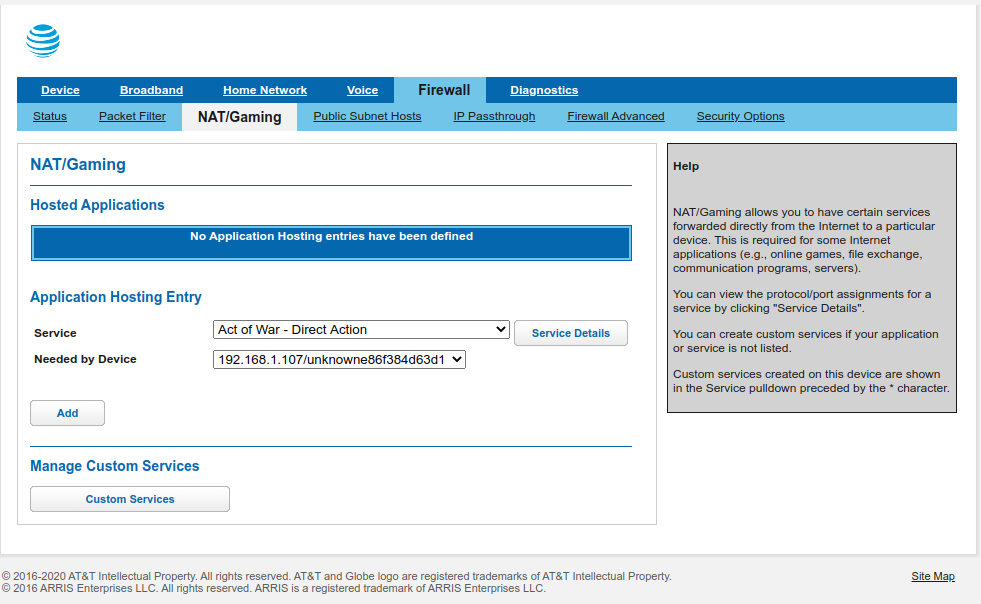
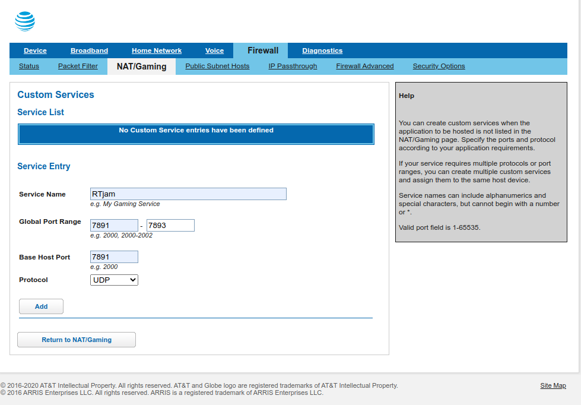
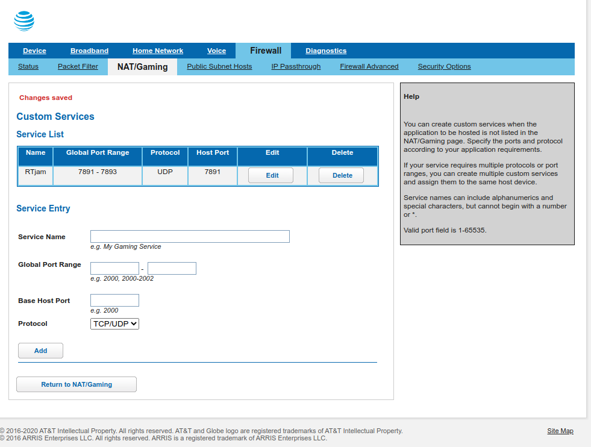
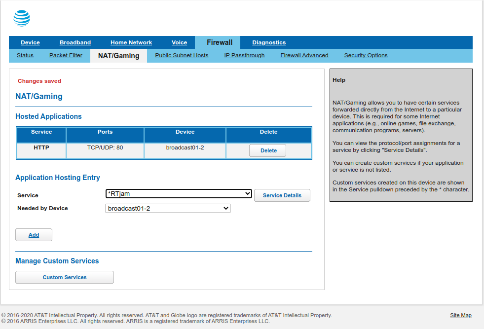
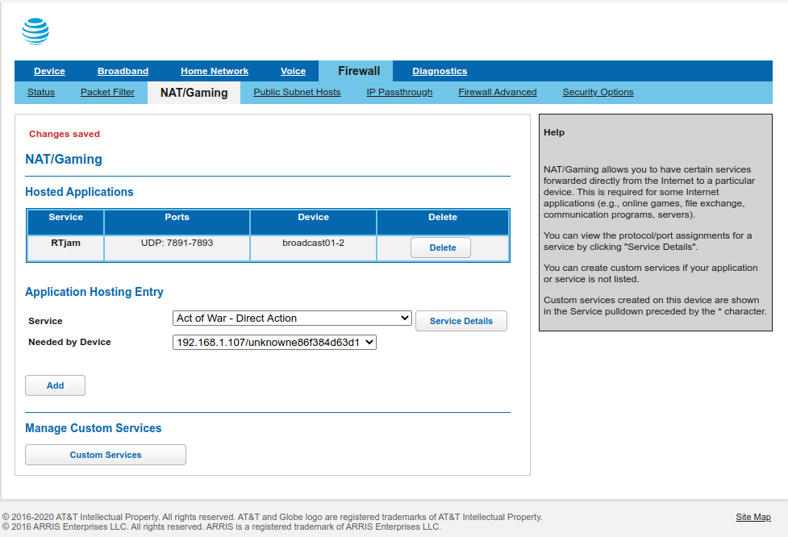

## Configure Your AT&T Router to host Broadcast server

In order to pass traffic through to the broadcast server you must configure UDP ports 7891-7893 (one port for each room) to pass through the router to the broadcast server unit.

### Step 1 find the broadcast server

Go to the home page on the AT&T router. Might be at http://192.168.1.254/cgi-bin/home.ha

In the device list at the bottom you should see the broadcast units name. On my network it is broadcast01-02 at 192.168.1.64 but it will very likely be something else on your network. Once you know the name that the router has given to the device, you can use that name to setup the UDP forwarding. You don't have to but you might consider telling the router to allocate the same address to the unit every time. (useful if you ever want to ssh into the unit).

### Step 2 create a custom service in the router firewall => NAT/Gaming screen

Go to the firewall page and then to the NAT/Gaming tab (the router will ask for the access password which is on the barcode on the side of the router)

Once you get to the NAT/Gaming page you shoud see something like this:

Click on the Custom Services Button and create a new service (I called mine RTJam) and give it UDP ports 7891-7893

After you hit add you should see this:

Click on Return to NAT/Gaming

### Step 3 add the new rule to your broadcast unit

Select the new RTJam protocol in the "Service" dropdown and the name of your broadcast unit in the "Needed by Device" dropdown.

After you hit add, you should see the Service in the list

The router will now be passing traffic for the rooms hosted on those port to the broadcast unit on your network.
